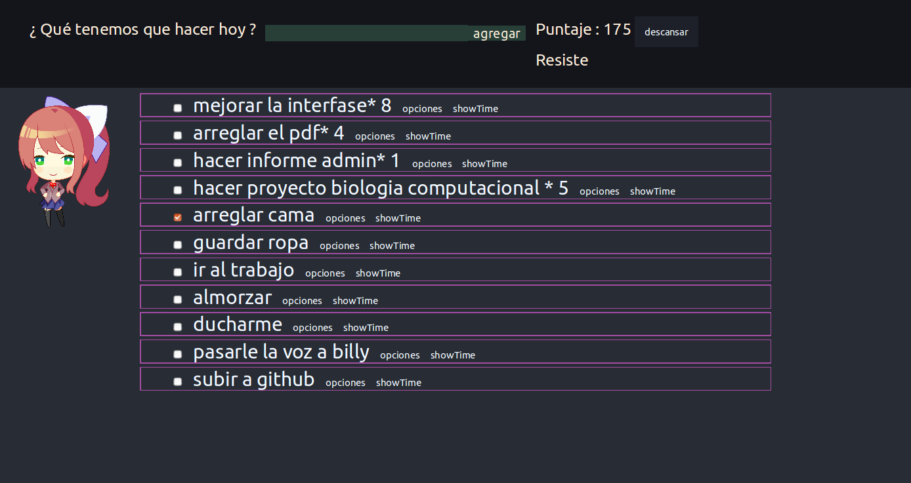
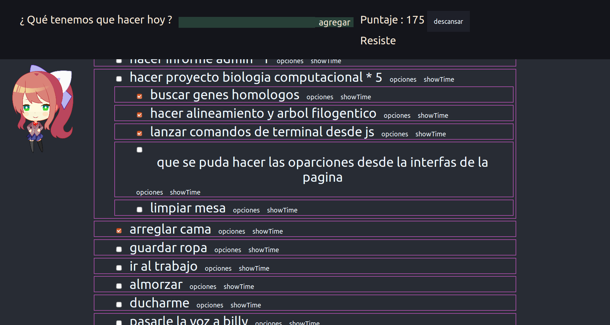

# Meta_manager

proyecto en hecho en  react 
* Puedes crear una serie de anotaciones , que pueden ser editadas ,
* borradas  
* ver las fechas y hora se anotacion  
* agregar submatas 
* la informacion se guarda en un packge json data.js 
* se les puede dar check y esto accionara un gift 
* Incluye un servidor encargado de guardar el packge json 

 
 
